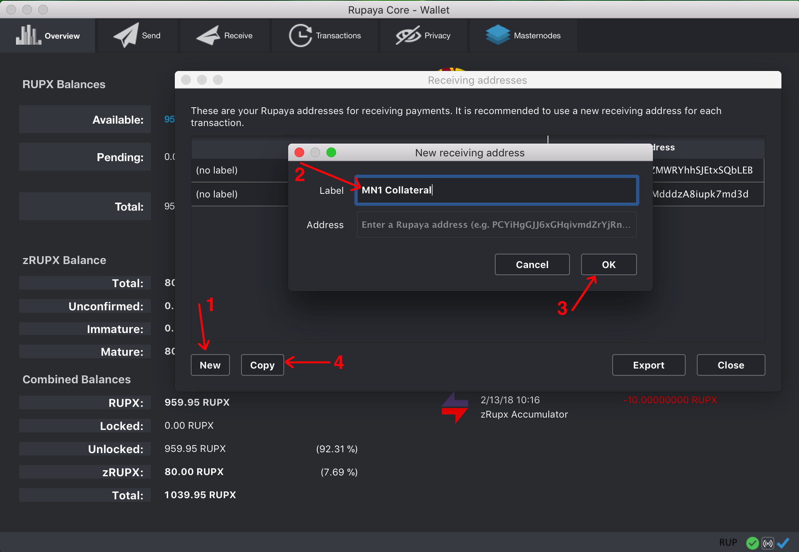

# Rupaya Hot + Cold wallet MasterNode setup guide

> This is a community contributed guide. Feel free to suggest improvements via Issues or opening Pull Requests. Thank you!

> The guide takes the time to explain not just _How_ but also _Why_ we do certain things. By using Linux for the hot wallet you'll have the opportunity to expand your knowledge into the open source, highly available and performat operating system that powers the Internet. I'll close this though with a quote by Benjamin Franklin: "An investment in knowledge pays the best interest"


> It's very common in this industry for scammers to offer "help" via remote screen sharing(TeamViewer, Skype, Zoom, WebEx, etc).
They will use nicknames like `Masternode Helper`, `Masternode Support`, `Cryptopia Support` and will be very nice and helpful to you. At least until they manage to run a command like `dumpprivkey`, `sendtoaddress` and your funds will be gone, adios, sayonara.
Please be aware and stay safe!

**!!! This guide is for setting up a new MasterNode using the new (dark theme) Rupaya v4 wallet and chain !!!**

---

## Setup overview

### Hot Wallet
In this guide, we refer to **Hot** wallet as the Rypaya wallet (Linux or Windows) that is running on the MasterNode server, with public IP address on it, providing services to the blockchain network for which it's rewarded with coins.
It's **Hot** because it's out on the public internet 24/7, directly accessible on the peer-to-peer port (TCP **9020**), much more vulnerable than a **Cold** wallet. 
That's why we are running it with a balance of 0 coins.

It's strongly recommended not to run a MasterNode Hot wallet at home! See a list of reasons [here](mn_dont_do_this_at_home.md).

### Cold Wallet
On the other side, the **Cold** wallet (Windows, OSX, Linux) holds the RUPX collateral (**10,000** RUPX) and is used to enable the MasterNode server and collect rewards for its services.

This is normally run at home, behind firewall, without direct connectivity from the internet, making it a more secure wallet. Once the MasterNode is enabled. The local wallet can then be stopped and MasterNode rewards will still show up on the next wallet start and sync.


---

We are going to setup the Hot wallet first. This will reduce the overall time as the Hot wallet will sync the blockchain while we setup the Cold wallet. It also requires less back-and-forth between the two.

## **Hot** MasterNode VPS Setup(Part 1) with Linux CLI only wallet

This will run 24/7 and provide services to the network via TCP port **9020** for which it will be rewarded with coins. It will run with an empty wallet reducing the risk of loosing the funds in the event of an attack.

### 1. Get a VPS server from a provider like Vultr, DigitalOcean, Linode, Amazon AWS, etc. 

Requirements:
* Linux 64 bit, (e.g. Ubuntu **16.04**) running on a server in the cloud 24/7. e.g: VPS such as Vultr, Amazon EC2 instance, Azure instance
* Dedicated Public IP Address
* Recommended at least 1GB of RAM and 20GB of disk space
* Basic Linux skills

You can get servers like this for $5 a month and can run 3,4 MasterNode wallets from different coins if the monthly cost is a concern.


### 2. Login via SSH into the server and type the following command in the console as root:

If you are using Windows, [PuTTY](https://putty.org) is a very good SSH client that you can use to connect to a remote Linux server.
If you are running a VPS from Vultr or similar, you need to use SSH such as putty if you want to copy and paste these commands otherwise you will have to type them all out!

### 3. Configure swap to avoid running out of memory if you don't have a swap :

```
fallocate -l 3000M /mnt/3000MB.swap
dd if=/dev/zero of=/mnt/3000MB.swap bs=1024 count=3072000
mkswap /mnt/3000MB.swap
swapon /mnt/3000MB.swap
chmod 600 /mnt/3000MB.swap
echo '/mnt/3000MB.swap  none  swap  sw 0  0' >> /etc/fstab
```

### 4. Allow SSH and MasterNode p2p communication port through the OS firewall:

```
ufw allow 22/tcp
ufw limit 22/tcp
ufw allow 9020/tcp
ufw logging on
ufw --force enable
```

If you are running the MasterNode server in Amazon AWS or if additional firewalls are in place, you need to allow incoming connections on port TCP **9020** from any IP address.

### 5. Install the Rupaya CLI wallet. Always download the latest [release available](https://github.com/rupaya-project/rupaya/releases), unpack it


Download and unpack the Rupaya wallet binaries by running the following commands:

This command uses a short github url to download [rupaya-4.1.0-x86_64-linux.tar.gz](https://github.com/rupaya-project/rupaya/releases/download/v.4.1.0/rupaya-4.1.0-x86_64-linux.tar.gz) and unpack the binaries in the PATH:

```
sudo wget -qO- https://git.io/vpeSF | tar xvz -C /usr/local/bin/
rupayad
```

You'll get a start error like `Error: To use rupayad, or the -server option to rupaya-qt, you must set an rpcpassword in the configuration file`. It's expected because we haven't created the config file yet.

The service will only start for a second and create the initial data directory(`/root/.rupaya/`).

### 6. Edit the MasterNode main wallet configuration file:
```
nano /root/.rupaya/rupaya.conf
```

Enter this wallet configuration data and change accordingly:
```
rpcuser=<alphanumeric_rpc_username>
rpcpassword=<alphanumeric_rpc_password>
rpcport=7020
rpcallowip=127.0.0.1
rpcconnect=127.0.0.1
rpcbind=127.0.0.1
maxconnections=512
listen=1
daemon=1
externalip=<public_mn_ip_address_here>:9020
masternodeaddr=<public_mn_ip_address_here>:9020
addnode=seeds.rupx.io
```
You can right click in SSH (putty) to paste all of the above

Exit the editor by CTRL+X and hit Y + ENTER to commit your changes.

This is a real example:
```
rpcuser=rupxuser
rpcpassword=someSUPERsecurePASSWORD3746375620
rpcport=7020
rpcallowip=127.0.0.1
rpcconnect=127.0.0.1
rpcbind=127.0.0.1
maxconnections=512
listen=1
daemon=1
externalip=199.247.10.25:9020
masternodeaddr=199.247.10.25:9020
addnode=seeds.rupx.io
```

The IP address (`199.247.10.25` in this example) will be different for you. Use the `ifconfig` command to find out your IP address, normally the address of the `eth0` interface. We are going to use this IP and port (9020) in the Cold Wallet setup(Step 2) as well.

### 7. Start the service and let's obtain the value for `masternodeprivkey`:
```
rupayad
```

Wait a few seconds then run this command to generate the masternode private key:
```
rupaya-cli masternode genkey
```

Copy to your clipboard the value returned, similar to this:
```
87LBTcfgkepEddWNFrJcut76rFp9wQG6rgbqPhqHWGvy13A9hJK
```

Edit the configuration file again: 
```
nano /root/.rupaya/rupaya.conf
```

Add these two lines at the end of the file. The second line is taking the value you received from the `rupaya-cli masternode genkey` command:
```
masternode=1
masternodeprivkey=<your_masternode_genkey_output>
```

In my case this was:
```
masternode=1
masternodeprivkey=87LBTcfgkepEddWNFrJcut76rFp9wQG6rgbqPhqHWGvy13A9hJK
```

Exit the editor by CTRL+X and hit Y + ENTER to commit your changes.


Stop the wallet and wait 2 minutes before attempting a start:
```
rupaya-cli stop && sleep 120
rupayad
```

### 8. Verify that the wallet is synching the blockchain:
Run this command every few mins until you see the blocks increasing.
```
rupaya-cli getinfo
``` 
We can now go to the next step while this wallet syncs up with the network and gets social with the other MasterNodes.


---


## **Cold** Wallet Setup(Part 2) using the Qt GUI wallet on Windows, OSX, etc

Requirements:
* Windows 7 or higher, Mac OS or Linux
* Outgoing internet access to sync the blockchain and enable the MasterNode remotely

This is the wallet where the MasterNode collateral will have to be transferred and stored. After the setup is complete, this wallet doesn't have to run 24/7 and will be the one receiving the rewards.

### 1. Install and open the Rupaya-Qt wallet on your machine.

 * If you have a previous Rupaya wallet installed, backup the `wallet.dat`, uninstall it then delete its original data directory.
 * Download the newest Rupaya Qt wallet from: https://github.com/rupaya-project/rupaya/releases
 * The Windows wallet needs to be extracted to a permanent location, OSX Wallet goes into `Applications`
 * Start the wallet software and ignore the unidentified developer warning.
 * If you are prompted to Allow Access by the firewall, do so.
 * Let the wallet sync until you see this in the bottom right corner of your Wallet

 * If the wallet is not synching, add this line in the configuration file:
```
addnode=seeds.rupx.io
```
The Qt wallet will open the configuration from `Tools` > `Open Wallet Configuration File`. Restart the wallet every time you update the configuration.

### 2. Create a receiving address for the Masternode collateral funds.

   Go to File -> Receiving addresses...
   
   Click **New**, type in a label and press **Ok**.



Select the row of the newly added address and click **Copy** to store the destination address in the clipboard.

### 3. Send EXACTLY 10000 RUPX coins to the address you just copied. Double check you've got the correct address before transferring the funds.
If you are sending from an exchange, make sure you account for the withdrawal fee so that you get EXACTLY EXACTLY EXACTLY 10000 RUPX in. This is a common error that will cause the next step to not give you the transaction id needed later on. 
For example, to withdraw from `Stocks.Exchange` the exact ammount for a MasterNode, you need to specify the ammount of **10000.001** to account for the fee.

After sending, you can verify the balance in the Transactions tab. This can take **a few minutes** to be confirmed by the network. Go get a glass of water. No alcoholic beverages please, we are not out of the woods yet.

### 4. Open the debug console of the wallet in order to type a few commands. 

Go to `Tools` -> `Debug console`

### 5. Run `masternode outputs` command to retrieve the transaction ID of the collateral transfer.

   You should see an output that looks like this:
   ```
   [
      {
        "txhash" : "c19972e47d2a77d3ff23c2dbd8b2b204f9a64a46fed0608ce57cf76ba9216487",
        "outputidx" : 1
      }
   ]
   ```

   Both `txhash` and `outputidx` will be used in the next step. `outputidx` can be `0` or `1`, both are valid values
   
### 6. Go to `Tools` -> `Open Masternode Configuration File` and add a line in the newly opened `masternode.conf` file. 

If you get prompted to choose a program, select a text editor like Notepad/TextEdit to open it.

These are the default directories for the data directory where this file is stored:
 * Mac: `~/Library/Application Support/Rupaya`
 * Windows: `~\AppData\Roaming\Rupaya`

This is an example of what you need in `masternode.conf`.

The file will contain an example that is commented out(with a # in front). Read it if it helps. Based on the above values, I would add this line in:
```
MN1 199.247.10.25:9020 87LBTcfgkepEddWNFrJcut76rFp9wQG6rgbqPhqHWGvy13A9hJK c19972e47d2a77d3ff23c2dbd8b2b204f9a64a46fed0608ce57cf76ba9216487 1
```

Where `MN1` is the node's alias.

Where `199.247.10.25` is the external IP of the masternode server that will provide services to the network.

Where `87LBTcfgkepEddWNFrJcut76rFp9wQG6rgbqPhqHWGvy13A9hJK` is your masternode key from (Part 1), the value used for `masternodeprivkey` in `/root/.rupaya/rupaya.conf`.

Where `c19972e47d2a77d3ff23c2dbd8b2b204f9a64a46fed0608ce57cf76ba9216487` is your txhash from `masternode outputs`.

Where `1` is your outputidx from `masternode outputs`.
      
### 7. Restart the Qt wallet to pick up the `masternode.conf` changes.
### 8. Go to Masternodes tab and check if your newly added masternode is listed.

If you want to control multiple hot wallets from this cold wallet, you will need to repeat the previous 2-7 steps. The `masternode.conf` file will contain an entry for each masternode that will be added to the network.

### 9. Enable the MasterNode

Open `Tools` > `Debug console`.

Type this command to see all the MasterNodes loaded from the `masternode.conf` file with their current status:
```
masternode list-conf
```

You should now see the newly added MasterNode with a status of `MISSING`.

Run the following command, in order to enable it:
```
startmasternode alias false MN1
```
In this ^ case, the alias of my MasterNode was MN1, in your case, it might be different.

Alternatively, if the `startmasternode` command is not working, you can go to the **Masternodes** tab of the wallet, click on the node you want to activate and then click **Start alias**

---

## Verify that the MasterNode is enabled and contributing to the network

Switch back to the MasterNode console.
Give it a few minutes and go to the Linux VPS console and check the status of the masternode with this command:
```
rupaya-cli masternode status
```

If you see status `Not capable masternode: Hot node, waiting for remote activation`, you need to wait a bit longer for the blockchain to reach consensus. It's not uncommon to take 30 minutes before activation can be done.

If you see status `Masternode successfully started`, you've done it, congratulations. Go hug someone now :)
It will take a few hours until the first rewards start coming in.

You should now be able to see your MasterNode(s) **ENABLED** on this web page: [http://mn.rupx.io](http://mn.rupx.io)

Cheers !
